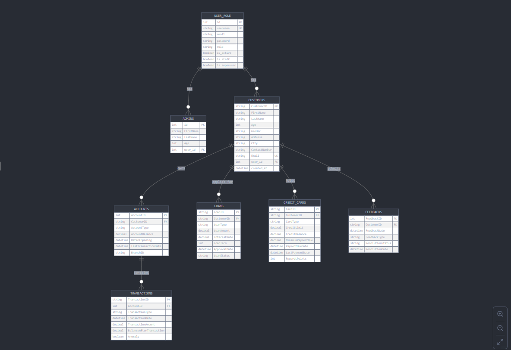

# 🧠 Project Overview

This project implements a **complete data engineering and access-controlled analytics pipeline** using **Django ORM** and **Apache Spark (PySpark API)**. The workflow begins with well-structured relational models in Django representing **Users**, **Admins**, **Customers**, **Accounts**, **Transactions**, **Loans**, and **CreditCards**. Each entity is interlinked with strict **referential integrity** and managed within **atomic transactions** to maintain data consistency. Data ingestion follows an **ETL architecture**, where raw banking records are extracted, cleaned, normalized, and transformed using **Spark’s distributed processing** capabilities. Through Spark **DataFrame operations**—such as **schema inference**, **joins**, **column transformations**, and **aggregations**—the datasets are optimized for **high-performance analytics** before being persisted into the **Django-backed database**.

**Role-Based Access Control (RBAC)** is seamlessly embedded through the `UserRole` model, extending Django’s `AbstractUser` to distinguish between **admin** and **user** privileges. Admins are automatically provisioned upon record creation, enabling **controlled access to sensitive financial data** while maintaining **auditability** and **separation of concerns**. The next development phase integrates **Django REST Framework (DRF)** serialization, exposing curated data via **RESTful APIs** to support secure downstream access, visualization, and **machine learning** applications. This architecture embodies a unified design where **data governance**, **scalability**, and **analytical depth** converge—transforming traditional ORM persistence into a **robust, API-driven data infrastructure** powered by **PySpark**, **Django**, and **REST Framework**.

---

### 🧩 Entity Relationship Diagram (ERD)

The diagram below illustrates the database schema and relationships between **Users**, **Customers**, **Accounts**, **Transactions**, **Loans**, and **CreditCards**, providing a clear view of data flow and referential integrity:

